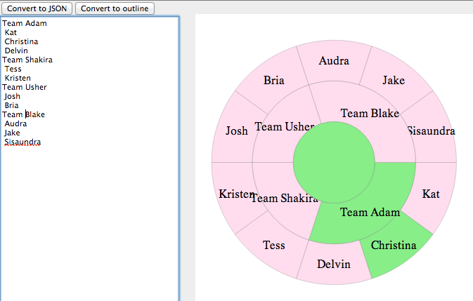

# Tree Pie

Easily create tree pies (a.k.a. [multilevel pie chart, sunburst diagram, ring chart](http://en.wikipedia.org/wiki/Pie_chart#Ring_chart_.2F_Sunburst_chart_.2F_Multilevel_pie_chart), or [radial tree](http://en.wikipedia.org/wiki/Radial_tree).  You can create the tree (while seeing live updates) by typing a plain-text outline or JSON, and you can easily convert bewteen the two formats.

Live app: http://avh4.github.io/treepie/ (your data will be saved in local storage)




## Development

```
npm install
webpack app.js bundle.js
open index.html
```
